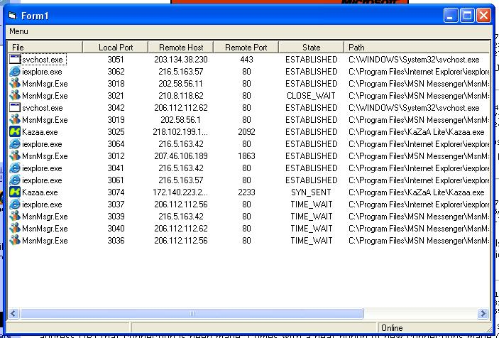



## View all connections\(Firewall\) complete API \(no netstat\)

### Description

Using the AllocateAndGetTcpExTableFromStack API this returns a instant collection of all connections made by your computer showing them in a listview and have there appropriate application icons, also allows you to terminate a appication or close a connection. take a look at screenshot.
 
### More Info
 

             |
---                |---
**Submitted On**   |2003-10-30 22:03:02
**By**             |[JayStacey](https://github.com/Planet-Source-Code/PSCIndex/blob/master/ByAuthor/jaystacey.md)
**Level**          |Intermediate
**User Rating**    |5.0 (80 globes from 16 users)
**Compatibility**  |VB 6\.0
**Category**       |[Internet/ HTML](https://github.com/Planet-Source-Code/PSCIndex/blob/master/ByCategory/internet-html__1-34.md)
**World**          |[Visual Basic](https://github.com/Planet-Source-Code/PSCIndex/blob/master/ByWorld/visual-basic.md)
**Archive File**   |[View\_all\_c16655210312003\.zip](https://github.com/Planet-Source-Code/jaystacey-view-all-connections-firewall-complete-api-no-netstat__1-49563/archive/master.zip)

